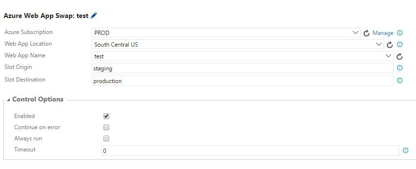

# Web App Swap Task

This is an extension for Visual Studio Team Services.

It adds a task that allows you to make swap between deployment slots of a web app.

## Images

## Disclaimer
This task works only with Classic Azure Endpoints. For ARM Endpoints use the official task developed by Microsoft (which only works with ARM):

## Source
[GitHub](https://github.com/Duber/AzureReleaseSwapTask)

## Issues
[File an issue](https://github.com/Duber/AzureReleaseSwapTask/issues)

## Credits
[Alejandro Melis](https://github.com/alejandromelis) and [Miguel Cruz](http://www.miguelcruz.net)
